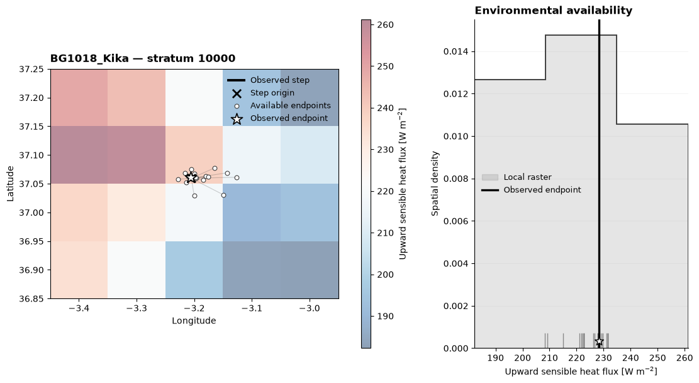
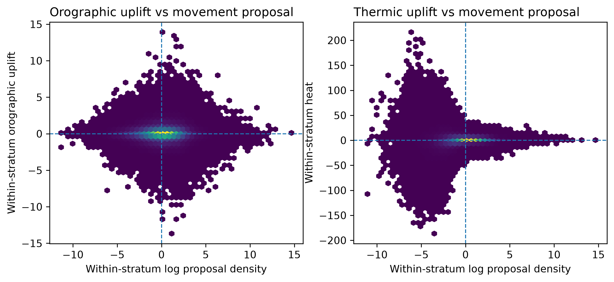
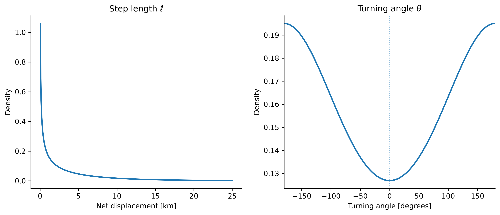
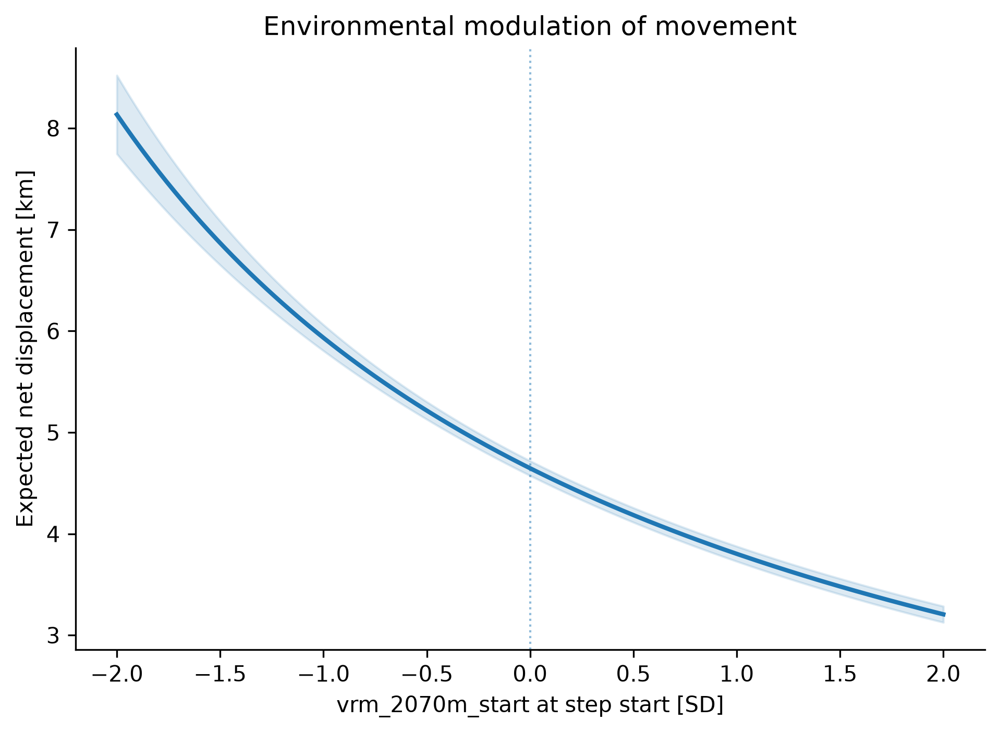
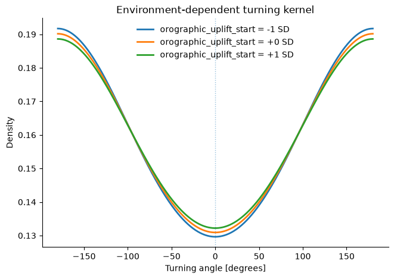
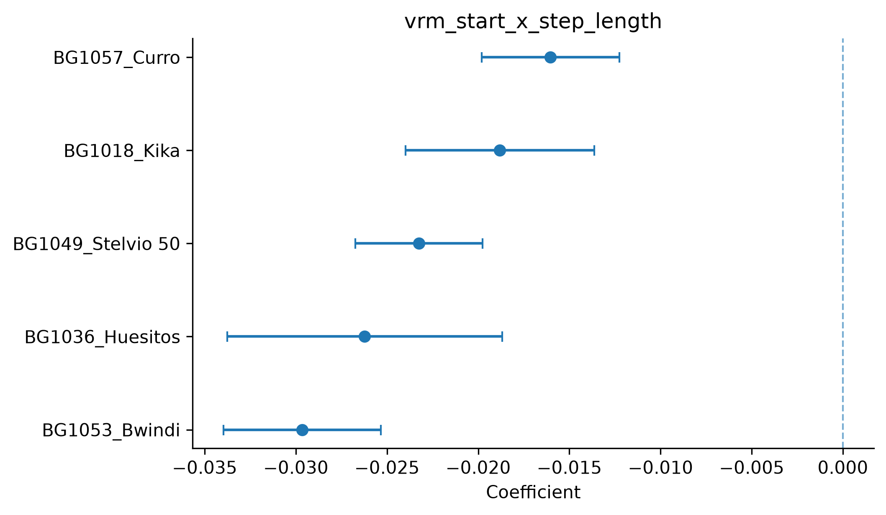
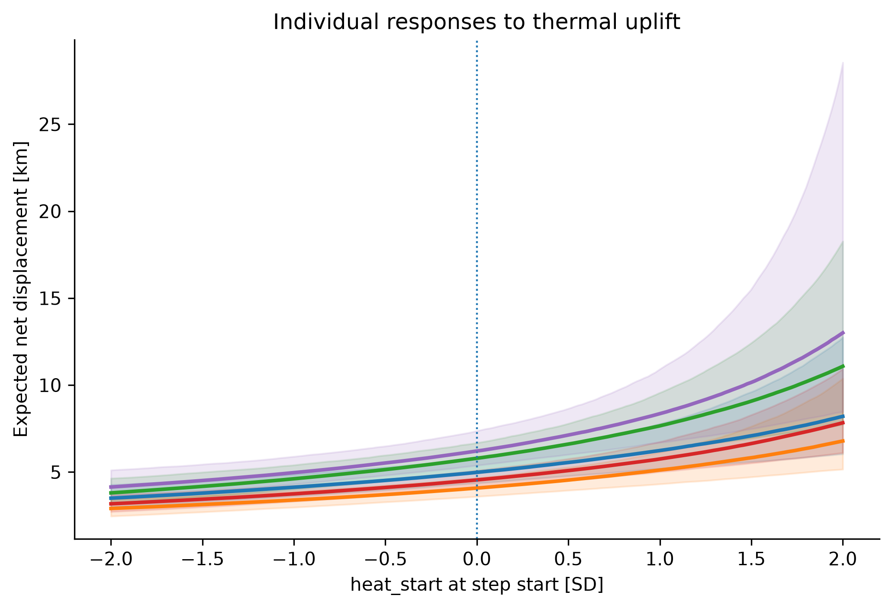

# Case studies

The following case studies illustrate how the same general habitat-selection framework can be adapted to increasingly complex ecological questions. We begin with a static landscape-scale RSF for ground pangolins, where high-resolution remote sensing is used to translate a qualitative hypothesis about vegetation structure into measurable environmental predictors. We then consider seasonal habitat selection in African lions, where the response to a single landscape feature changes through time and differs among individuals. The final bearded-vulture case study extends these ideas to movement-constrained availability and dynamically varying environmental conditions.

---

## 1. Ground pangolins — resolving habitat structure from space

### Ecological question

Ground pangolins (*Smutsia temminckii*) remain difficult to study because they are solitary, nocturnal, and spend a substantial fraction of their time underground. Telemetry consequently provides an unusual opportunity to quantify habitat use, but relatively small sample sizes and geographically restricted study populations make it important to distinguish population-level patterns from individual variation.

Here we ask whether pangolins preferentially use **structural habitat edges** between relatively dense woody vegetation and more open areas. Field observations suggest that such ecotones may combine several favourable properties: open areas can provide access to ant and termite prey, while nearby dense vegetation provides cover and refuge. If this mechanism is important, pangolin habitat should not be described simply by vegetation greenness or woody cover alone, but by the spatial arrangement of contrasting vegetation structures.

Testing this hypothesis requires translating the qualitative concept of an *edge* into environmental variables that can be evaluated at every observed and available location.

### From Earth observation to ecological predictors

We analysed telemetry from 26 ground pangolins collected between July 2024 and April 2026. Individuals contributed on average approximately 1,022 relocations, with individual sample sizes ranging from 589 to 2,008 fixes. Collar acquisition was restricted primarily to periods when animals were active above ground, providing approximately five to six fixes during a typical night of activity.

The environmental representation combined optical, radar, terrain, and soil information. NDVI described vegetation productivity, while Sentinel-1 VH backscatter provided complementary information on vegetation and surface structure. We smoothed the radar signal and identified abrupt spatial transitions from the resulting field. These transitions were subsequently represented through two complementary variables: **distance to the nearest radar-derived edge**, describing proximity to structural boundaries, and **local edge density**, describing the amount of structural heterogeneity surrounding a location. Terrain slope and soil texture provided additional environmental contrasts.

```{thumbnail} assets/case-studies/pangolin/pangolin-predictor-stack.png
:width: 100%
```

*Environmental predictors used to describe pangolin habitat. Optical vegetation productivity is complemented by radar-derived vegetation structure, the distance to structural edges, local edge density, terrain slope, and topsoil texture. The edge metrics convert a qualitative field hypothesis about bush–grassland ecotones into spatially explicit predictors that can be evaluated within a resource-selection model.*

This predictor stack illustrates an important role of Earth observation in habitat-selection analysis. Remote-sensing products are not necessarily ecological variables in themselves. Their value lies in whether they can be transformed into measurable representations of the ecological processes being hypothesized.

### Building the resource-selection function

We first fitted a conventional population-level RSF by comparing observed pangolin relocations with locations sampled from individual-specific availability domains. Rather than fitting a large model immediately, predictors were introduced progressively so that changes in the spatial selection surface could be related to the environmental information added at each stage.

```{thumbnail} assets/case-studies/pangolin/progressive_construction.png
:width: 100%
```

*Progressive construction of the pangolin RSF. Each panel shows centred log relative selection strength after adding another environmental component. NDVI captures broad variation in vegetation productivity; radar backscatter and structural-edge information progressively resolve finer landscape heterogeneity, while soil properties add further spatial contrast.*

The progression shows how increasingly detailed environmental information changes the inferred selection landscape. NDVI alone reproduces broad vegetation gradients but leaves considerable fine-scale structure unresolved. Adding Sentinel-1 information introduces structural contrast not visible in the optical vegetation index, while edge-related predictors resolve linear and patch-boundary features that correspond more closely to the original ecological hypothesis.

The resulting map should be interpreted as **relative selection under the specified availability design**, rather than as an absolute probability that a pangolin occurs at a location. Its principal value is therefore comparative: it identifies environmental combinations used disproportionately relative to the landscape available to the tracked animals.

### Validation reveals variation among individuals

Population-level predictive performance can conceal substantial heterogeneity among animals. We therefore evaluated transferability using leave-one-individual-out validation, fitting the model to all but one pangolin and evaluating its predictions against the availability domain of the held-out animal.

```{thumbnail} assets/case-studies/pangolin/boyce_curves.png
:width: 55%
```

*Example fold-specific Boyce calibration curves. Values above one indicate prediction classes in which observed use exceeds expectation under random use. Contrasting curves among held-out individuals illustrate why population-average validation statistics should not be interpreted without examining individual folds.*

Some individuals were predicted substantially better than others, and in some cases the direction of the observed selection gradient differed from the population expectation. This raises an ecological rather than merely numerical question: **does the population model fit poorly because some animals are weakly sampled, or because pangolins genuinely differ in their environmental responses?**

A completely pooled RSF cannot distinguish these possibilities because every animal shares the same selection coefficients.

### Hierarchical inference and individual variation

We therefore extend the model hierarchically. For individual $i$ and predictor $k$,

$$
\beta_{ik}
=
\mu_k
+
\sigma_k z_{ik},
\qquad
z_{ik}\sim\mathcal N(0,1),
$$

where $\mu_k$ describes the population-average response and $\sigma_k$ describes the magnitude of between-individual heterogeneity.

The hierarchy induces partial pooling. Individuals with strongly informative data can remain distinct from the population mean, whereas uncertain individual estimates are shrunk toward the population distribution. This avoids treating every animal as either identical or completely independent.

For larger correlated predictor sets, the same framework can be combined with regularizing priors so that weakly supported effects are shrunk toward zero while strongly supported effects remain comparatively unregularized. Importantly, shrinkage stabilizes the model; it does not replace ecological reasoning or turn the analysis into automatic causal variable selection.

```{thumbnail} assets/case-studies/pangolin/posterior_individual_slopes_ndvi.png
:width: 75%
```

*Posterior individual responses to NDVI at 30-m resolution. Points show individual posterior estimates with uncertainty intervals, while the vertical reference indicates no directional response. Partial pooling estimates a common population distribution while retaining substantial variation among individual pangolins.*

The posterior estimates reveal considerable heterogeneity in the response to the same environmental gradient. Some individuals show positive responses, others negative responses, and several remain close to zero. The biologically important result is therefore not simply a single population coefficient, but the distribution of responses across animals.

This distinction has direct consequences for ecological interpretation. A near-zero population mean can arise because all individuals respond weakly, but it can also arise because strong positive and negative responses cancel at the population level. Hierarchical models allow these situations to be distinguished.

### What this case study demonstrates

The pangolin analysis illustrates three levels of inference within a relatively conventional RSF. First, remote sensing can be used to construct predictors that correspond more closely to ecological mechanisms than the original satellite bands themselves. Second, spatial prediction should be interpreted relative to a biologically defined availability distribution. Third, population-level habitat relationships need not describe every member of the population equally well.

The case therefore moves from

```text
field hypothesis
      ↓
Earth-observation representation
      ↓
resource-selection function
      ↓
out-of-sample validation
      ↓
hierarchical individual responses
```

and provides a natural introduction to the hierarchical analyses developed further below.

---

## 2. African lions — habitat selection through time

### Ecological question

Habitat selection is not necessarily stationary. Environmental features that strongly influence space use during one part of the year may become less important—or change their functional role—as rainfall, vegetation, prey distribution, and water availability change.

River systems provide a useful example in semi-arid African landscapes. Riparian corridors can concentrate water, vegetation, cover, and prey and may therefore structure carnivore space use even when animals are not directly using the river channel itself. The ecological importance of these corridors should nevertheless depend on environmental context. During dry periods they can act as persistent resource concentrations, whereas rainfall can redistribute water and prey more broadly across the landscape.

We therefore ask:

> **How does lion selection for proximity to river systems change through time, and to what extent is that seasonal pattern shared among individuals?**

This question extends the static RSF framework in two directions. The environmental response itself is allowed to vary among seasons, while repeated measurements from multiple lions are treated hierarchically rather than as independent population replicates.

### A seasonal resource-selection model

Using telemetry from 21 lions, we fitted a hierarchical RSF in which the effect of river proximity was allowed to vary across successive seasons. Other environmental predictors remained in the model as controls, while the river coefficient became the principal time-varying ecological response.

A convenient representation is

$$
\eta_j
=
\alpha_i
+
\beta_{i,s[j]}
x_j^{\mathrm{river}}
+
\boldsymbol{\theta}^{\mathsf T}\mathbf{x}_j,
$$

where observation $j$ belongs to individual $i$ and season $s[j]$, $x_j^{\mathrm{river}}$ describes standardized river proximity, and $\mathbf{x}_j$ contains the remaining environmental predictors.

Rather than estimating every individual-by-season coefficient independently, the seasonal river response is decomposed hierarchically,

$$
\beta_{i,s}
=
\mu_\beta
+
\delta_s
+
b_i,
$$

where $\mu_\beta$ is the overall population response, $\delta_s$ describes the seasonal departure from that response, and

$$
b_i
\sim
\mathcal N
\left(
0,\sigma_{\mathrm{individual}}
\right)
$$

captures persistent differences among animals.

More elaborate formulations can additionally include ecological groups and group-specific seasonal trajectories. The essential idea remains the same: information is shared across seasons and individuals rather than fitting every combination independently.

### From a spatial surface to a temporal response

The fitted RSF translates the environmental model into a spatial selection surface.

```{thumbnail} assets/case-studies/lion/rsf_surface_lions.png
:width: 75%
```

*Example lion RSF surface. Colours describe relative selection under the fitted environmental model rather than absolute occurrence probability. River systems and their surrounding terrain contribute strongly to the spatial structure of predicted use.*

A single map, however, hides the temporal structure of the fitted model. The posterior seasonal coefficients reveal how the response to river proximity changes through time.

```{thumbnail} assets/case-studies/lion/river_proximity_coefficients.png
:width: 100%
```

*Seasonal individual responses to river proximity. Each line represents one lion and the dashed horizontal line denotes no directional selection. Negative coefficients correspond to increasing relative selection for locations closer to rivers when the predictor is expressed as distance or increasing proximity in the plotted convention.*

The temporal trajectories show that river-associated selection is not constant. Although considerable variation exists among individuals, much of the population moves through a shared sequence of stronger and weaker river association. Periods in which coefficients approach zero indicate seasons in which river proximity contributes relatively little to selection, whereas more strongly negative values indicate greater relative use of river-associated habitat under the fitted coding of the predictor.

The repeated seasonal structure is important because it changes the ecological interpretation of the RSF. A single coefficient fitted across the complete study period would describe an average response while obscuring when that relationship was strongest and whether individuals changed in parallel.

### Hierarchy separates shared change from individual differences

The hierarchical formulation distinguishes two forms of variation that would otherwise be confounded:

$$
\text{temporal variation}
\qquad\text{and}\qquad
\text{individual variation}.
$$

The seasonal component asks whether the population changes its relationship with river systems through time. The individual component asks whether some lions remain systematically more or less associated with rivers than others.

Partial pooling is particularly valuable here because not every animal contributes the same number of relocations to every season. Estimating each lion-season combination independently would make poorly sampled periods unstable; imposing a single coefficient would erase biologically meaningful heterogeneity. The hierarchical model lies between these extremes, allowing observations to inform a shared seasonal trajectory while retaining persistent individual departures from it.

In a Bayesian formulation, this distinction is represented by posterior distributions rather than only point estimates. Uncertainty in sparsely represented seasons or individuals consequently propagates into the seasonal trajectory instead of being hidden by an independently fitted coefficient.

### Ecological interpretation

The analysis demonstrates that a landscape feature need not have one fixed ecological meaning. River systems remain spatially static, but their importance to lions changes as the surrounding environment changes.

This distinction is central to interpreting habitat-selection models under environmental variability:

$$
\text{static landscape feature}
+
\text{changing ecological context}
\longrightarrow
\text{dynamic selection response}.
$$

River corridors may become particularly important when water, vegetation, and prey are concentrated around them, while their relative importance can diminish when favourable conditions become more widely distributed. The model identifies the temporal pattern in selection; attributing that pattern mechanistically to rainfall, prey redistribution, vegetation phenology, or other processes requires those drivers to be evaluated explicitly.

## Bearded vultures — understanding movement in dynamic conditions 

### 1. Question

Bearded vultures _(Gypaetus barbatus)_ move through a landscape in which the energetic cost of flight changes from hour to hour. The relevant landscape thus cannot be fully described in environmental space alone, but must be integrated through time to reveal an energy landscape dynamically generated by interactions between atmosphere and terrain. Soaring allows large birds to replace metabolically costly flapping with energy extracted from rising air, and vultures can sustain soaring–gliding flight at energetic costs close to resting levels under favourable conditions (Duriez et al., 2014). The central question of this case study is therefore:

> **How do bearded vultures select locations and modify their movement in response to dynamically varying thermal and orographic uplift conditions?**


Two mechanisms dominate inland soaring. Thermal soaring exploits buoyant ascent generated by surface heating; birds typically climb by circling within rising air and then convert altitude into horizontal displacement during glides. Slope soaring exploits mechanically generated uplift where horizontal wind is forced upward by topography. The relative importance of these modes changes with weather, topography and the spatial scale at which movement is observed (Bohrer et al., 2012; Santos et al., 2017; Harel et al., 2016; Scacco et al., 2019).


The statistical challenge is that the same conditions that affect *where* a bird moves can also affect *how* it moves. A step-selection analysis therefore becomes most informative when the habitat-selection and movement processes are estimated jointly.

---

## 2. Atmospheric forcing as mathematical predictors

### 2.1 Orographic uplift potential

Let the horizontal wind vector be

$$
\mathbf{u}=(u,v),
$$

where $u$ is the eastward wind component and $v$ the northward component. Let terrain aspect be represented by the unit components

$$
E=\sin A, \qquad N=\cos A,
$$

where $A$ is the **downslope** aspect measured clockwise from north. The unit vector toward steepest ascent is therefore

$$
\mathbf{s}_{\uparrow}=(-E,-N).
$$

The horizontal wind component directed upslope is

$$
U_{\uparrow}
=
\mathbf{u}\cdot\mathbf{s}_{\uparrow}
=
-uE-vN.
$$

If the local terrain slope is $\theta$, the terrain gradient in the steepest-slope direction is $\tan\theta$. We therefore use the kinematic proxy

$$
\boxed{
 w_{\mathrm{oro}}
 =
 (-uE-vN)\tan\theta
}
$$

with units of $m s^{-1}$ when $u$ and $v$ are in $m s^{-1}$. Positive values indicate wind directed upslope and therefore potential terrain-forced ascent; negative values indicate downslope flow. This is closely related to the terrain–wind formulations of Brandes & Ombalski (2004) and Bohrer et al. (2012), but is expressed directly as horizontal flow across the local terrain gradient.


*Orographic uplift potential across five hourly wind fields. The alternating positive and negative patches arise because a common wind field encounters opposing slope orientations. The spatial pattern is consequently more terrain-structured and less strongly diurnal than the thermal field.*

### 2.2 Thermal forcing

ERA5-Land is an hourly land-surface reanalysis at approximately 9 km native resolution (Muñoz-Sabater et al., 2021). It provides accumulated surface sensible heat flux, `sshf`. We first recover the hourly increment and convert the sign convention to upward-positive flux:

$$
\boxed{
H_t
=
-\frac{\mathrm{SSHF}_t-\mathrm{SSHF}_{t-1}}{3600}
}
$$

where $H_t$ is sensible heat flux upward in $W m^{-2}$. In the code below, accumulation resets are handled explicitly before differencing.

Positive $H$ means that sensible heat is transferred from the surface to the atmosphere. It is therefore a mechanistic proxy for the surface forcing that can produce buoyant convection.


*Hourly sensible heat flux shows a pronounced diurnal development. Unlike the ridge-scale structure of the orographic proxy, thermal forcing is spatially smoother because its atmospheric component is inherited from the coarser ERA5-Land field.*

---

## 3. From resource selection to integrated step selection

A resource-selection function asks whether used locations differ from a set of locations considered available. For standardized predictors $\mathbf{x}$, a conventional exponential RSF writes

$$
w(\mathbf{x})=\exp(\boldsymbol\beta^\top\mathbf{x}).
$$

The difficulty is the definition of availability. An SSF makes availability local and conditional on movement: each observed step is compared with alternative steps beginning at the same location (Fortin et al., 2005; Thurfjell et al., 2014).



For stratum $s$, let $j=0,\ldots,J-1$ index the observed endpoint and its alternatives. In this case study we draw $20$ available alternatives, so each retained stratum contains $J=21$ choices. The conditional-choice probability is

$$
\boxed{
P(Y_s=j)
=
\frac{\exp(\eta_{sj})}
{\sum_{k=0}^{J-1}\exp(\eta_{sk})}
}
$$

with one observed choice per stratum.

### 3.1 Movement-informed availability

Available steps are not drawn uniformly in space. For individual $i$, hrHSA first fits an individual movement proposal from observed step lengths and turning angles. Denote the resulting proposal density by

$$
q_i(L,\theta).
$$

Candidate steps are then sampled from this movement-conditioned proposal, subject to the temporal interval, speed limit and spatial domain. This concentrates computational effort on biologically plausible alternatives.

However, because the alternatives were sampled non-uniformly, the proposal density must be accounted for in the likelihood. If a target integral is approximated using draws from $q$, importance sampling contributes a factor $1/q$. On the log scale this becomes

$$
\boxed{o_{sj}=-\log q_{sj}}.
$$

The proposal-corrected utility is therefore

$$
\boxed{
\eta_{sj}
=
\boldsymbol\beta^\top\mathbf{x}_{sj}
-
\log q_{sj}
}
$$

for an endpoint-only model. The offset is fixed with coefficient exactly one; it is not an estimated ecological effect. hrHSA centers it within strata because any constant shared by all alternatives cancels from the conditional softmax.

### 3.2 The iSSF movement basis

Integrated step-selection analysis estimates habitat selection and movement jointly (Avgar et al., 2016). hrHSA uses the default movement basis

$$
\boxed{
\mathbf{m}_{sj}
=
\left(
L_{sj},
\log L_{sj},
\cos\theta_{sj}
\right)
}
$$

where $L$ is net displacement in kilometres and $\theta$ is the turning angle relative to the incoming heading.

The length terms imply a Gamma-like kernel

$$
f(L)
\propto
L^{\gamma_{\log L}}
\exp(\gamma_LL),
$$

so, when $1+\gamma_{\log L}>0$ and $\gamma_L<0$,

$$
k=1+\gamma_{\log L},
\qquad
\lambda=-\gamma_L,
\qquad
E[L]=\frac{k}{\lambda}.
$$

The turning term implies a von-Mises-like kernel

$$
f(\theta)
\propto
\exp\{\kappa\cos\theta\},
\qquad
\kappa=\gamma_{\cos\theta}.
$$

Thus $\kappa>0$ favours directional persistence around $0^\circ$, whereas $\kappa<0$ places relatively more mass toward large turning angles. At an hourly GPS interval this describes net displacement between fixes.

---

## 4. Data preparation

We use five tagged bearded vultures and retain approximately hourly relocations. All geometry used for step construction is projected to EPSG:2062 so that distances and bearings are computed in metric coordinates.

```python
import numpy as np
import pandas as pd
import geopandas as gpd
import xarray as xr
import matplotlib.pyplot as plt

from hsa.movement import (
    load_trajectory_data,
    prepare_trajectory_data,
)
from hsa.ssf import FrequentistISSF

ID_COL = "individual-local-identifier"
TIME_COL = "Timestamp"
N_AVAILABLE = 20
SEED = 42

birds = load_trajectory_data(
    "data/vector/birds",
    individuals=[
        "BG1018_Kika",
        "BG1036_Huesitos",
        "BG1049_Stelvio 50",
        "BG1053_Bwindi",
        "BG1057_Curro",
    ],
)

reloc = prepare_trajectory_data(
    birds,
    id_col=ID_COL,
    timestamp_col="timestamp",
    lon_col="location-long",
    lat_col="location-lat",
    source_crs="EPSG:4326",
    target_crs="EPSG:2062",
)

reloc = reloc[
    [ID_COL, TIME_COL, "geometry"]
].copy()

env = xr.open_zarr(
    "data/raster/vultures_terrain-SPAIN-2062.zarr",
    decode_coords="all",
)
```

ERA5-Land supplies the time-varying atmospheric forcing. Accumulated fluxes are converted to hourly rates before being sampled at step times.

```python
era5 = xr.open_dataset(
    "https://api.earthdatahub.destine.eu/era5/era5-land-v0.zarr",
    storage_options={
        "client_kwargs": {"trust_env": True}
    },
    chunks={},
    engine="zarr",
)


def era5_land_hourly_increment(
    da,
    *,
    time_name="valid_time",
):
    previous = da.shift({time_name: 1})
    increment = da - previous
    hour = da[time_name].dt.hour
    return xr.where(hour == 1, da, increment)


H = (
    -era5_land_hourly_increment(era5["sshf"])
    / 3600.0
).rename("sensible_heat_flux_upward")

met = xr.Dataset(
    {
        "sensible_heat_flux_upward": H,
        "skin_temperature": era5["skt"],
        "air_temperature_2m": era5["t2m"],
        "dewpoint_temperature_2m": era5["d2m"],
        "wind_u_10m": era5["u10"],
        "wind_v_10m": era5["v10"],
    }
)

met["surface_air_temperature_excess"] = (
    met["skin_temperature"]
    - met["air_temperature_2m"]
)

met["dewpoint_depression"] = (
    met["air_temperature_2m"]
    - met["dewpoint_temperature_2m"]
)

met["wind_speed_10m"] = np.hypot(
    met["wind_u_10m"],
    met["wind_v_10m"],
)
```

---

## 5. Constructing the choice sets

```python
issf = FrequentistISSF(
    reloc,
    id_col=ID_COL,
    timestamp_col=TIME_COL,
    expected_interval_min=60,
    tolerance_min=10,
)

issf.sample(
    n_available=N_AVAILABLE,
    seed=SEED,
    domain=env,
    observed_outside="exclude",
)
```

The current exploratory dataset yields complete strata with one observed and 20 available alternatives. The crucial point is that the alternatives are generated from individual-specific movement kernels and not from an arbitrary spatial buffer.

```python
movement_kernels = issf.movement_["summary"]
movement_kernels.head()
```

The fitted proposal determines $q_i(L,\theta)$, while the later iSSF asks whether the observed movement kernel differs systematically with environmental conditions.

---

## 6. Endpoint, start and directional predictors

The three predictor roles correspond to three different mathematical objects.

| Role | Notation | Varies within stratum? | Example | Interpretation |
|---|---:|:---:|---|---|
| Endpoint | $x_{sj}$ | Yes | elevation, slope, heat, endpoint orographic uplift | Does the bird choose this endpoint over the alternatives? |
| Start condition | $z_s$ | No | heat at departure, VRM at departure, orographic uplift at departure | Does the departure environment change the movement kernel? |
| Directional | $d_{sj}$ | Yes | wind support projected onto candidate bearing | Does movement become more likely in directions supported by the vector field? |

A start-condition main effect cannot be estimated in a conditional choice model because it is identical for every candidate in the stratum:

$$
\frac{\exp(c_s+\eta_{sj})}
{\sum_k\exp(c_s+\eta_{sk})}
=
\frac{\exp(\eta_{sj})}
{\sum_k\exp(\eta_{sk})}.
$$

Therefore a start condition enters through interactions with movement terms. For example,

$$
\gamma_L(z_s)
=
\gamma_L+\delta_Lz_s,
$$

so that the step-length distribution changes with the environment at departure.

A directional predictor is different. For candidate bearing $\phi_{sj}$, start-point wind support is

$$
\boxed{
D_{sj}
=u_s\sin\phi_{sj}+v_s\cos\phi_{sj}
}
$$

where $u_s$ and $v_s$ are the eastward and northward wind components at the common step start. $D_{sj}>0$ is tailwind support and $D_{sj}<0$ is headwind. Although the wind vector is shared within the stratum, its projection changes with candidate direction; the predictor therefore has an identifiable main effect and can also modify the movement kernel.

A convenient annotation workflow is:

```python
issf.annotate_static(
    env,
    endpoint=[
        "elevation",
        "slope",
        "eastness",
        "northness",
        "vrm_2070m",
        "tpi_2070m",
    ],
    start=[
        "elevation",
        "slope",
        "eastness",
        "northness",
        "vrm_2070m",
        "tpi_2070m",
    ],
)

issf.annotate_dynamic(
    met,
    endpoint={
        "sensible_heat_flux_upward": "heat",
    },
    start={
        "sensible_heat_flux_upward": "heat_start",
    },
    method="linear",
)

issf.annotate_vector(
    met,
    u="wind_u_10m",
    v="wind_v_10m",
    prefix="wind",
    at=("endpoint", "start"),
    support=True,
    method="linear",
)
```

The orographic proxies can then be derived at both endpoint and start:

```python
def orographic_uplift(
    slope_deg,
    eastness,
    northness,
    u,
    v,
):
    slope_rad = np.deg2rad(
        np.asarray(slope_deg, dtype=float)
    )

    wind_upslope = (
        -np.asarray(u, dtype=float)
        * np.asarray(eastness, dtype=float)
        -np.asarray(v, dtype=float)
        * np.asarray(northness, dtype=float)
    )

    return wind_upslope * np.tan(slope_rad)


choices = issf.choices.copy()

choices["orographic_uplift"] = orographic_uplift(
    choices["slope"],
    choices["eastness"],
    choices["northness"],
    choices["wind_u"],
    choices["wind_v"],
)

choices["orographic_uplift_start"] = orographic_uplift(
    choices["slope_start"],
    choices["eastness_start"],
    choices["northness_start"],
    choices["wind_u_start"],
    choices["wind_v_start"],
)

issf.choices_ = choices
```

---

# 7. A sequence of increasingly mechanistic models

Rather than fitting the most complex model immediately, we add one statistical idea at a time. This makes every change in the coefficients interpretable.

## 7.1 Model 1 — naive endpoint SSF

We begin with a conventional conditional-choice model and deliberately ignore the non-uniform proposal density:

$$
\eta^{(1)}_{sj}
=
\boldsymbol\beta^\top\mathbf{x}_{sj}.
$$

```python
selection = [
    "elevation",
    "slope",
    "vrm_2070m",
    "tpi_2070m",
    "heat",
    "orographic_uplift",
]

issf.set_model(
    selection=selection,
    movement=False,
    proposal_correction=False,
)

design_naive = issf.prepare_design()

fit_naive = issf.fit(
    scaling=design_naive.scaling,
    engine="fast",
    method="lbfgs",
    maxiter=1000,
)
```

All endpoint predictors are standardized before fitting,

$$
x_z=\frac{x-\mu_x}{\sigma_x}.
$$

For a standardized contrast $\Delta x$, the relative-selection ratio is

$$
\boxed{
RSS(\Delta x)=\exp(\beta\Delta x)
}.
$$

For $\Delta x=1$, the naive fit gives:

| Predictor | $\hat\beta$ | 95% CI | $e^{\beta}$ |
|---|---:|---:|---:|
| Elevation | 0.851 | 0.830–0.872 | 2.34 |
| Slope | 0.681 | 0.673–0.689 | 1.98 |
| VRM (2070 m) | 0.243 | 0.233–0.252 | 1.27 |
| TPI (2070 m) | 0.074 | 0.066–0.081 | 1.08 |
| Sensible heat flux | 0.318 | 0.180–0.457 | 1.37 |
| Orographic uplift | 0.007 | 0.001–0.013 | 1.007 |

The dominant pattern is selection for high and steep terrain, with additional positive effects of ruggedness and heat. The endpoint orographic coefficient is close to zero in magnitude. This should not be read as evidence that orographic soaring is unimportant: a localized uplift can modify movement during the step without necessarily making the *endpoint* itself strongly preferred.

Because the choice likelihood is driven by within-stratum contrasts, $e^\beta$ should not automatically be interpreted as the effect of a typical choice. For a more realistic contrast $\Delta x$, use $\exp(\beta\Delta x)$.

## 7.2 Model 2 — proposal-corrected endpoint SSF

We now fit exactly the same ecological model but account for the density from which alternatives were sampled:

$$
\eta^{(2)}_{sj}
=
\boldsymbol\beta^\top\mathbf{x}_{sj}
-
\log q_{sj}.
$$

```python
issf.set_model(
    selection=selection,
    movement=False,
    proposal_correction=True,
)

design_corrected = issf.prepare_design(
    scaling=design_naive.scaling,
)

fit_corrected = issf.fit(
    scaling=design_naive.scaling,
    engine="fast",
    method="lbfgs",
    maxiter=1000,
)
```

| Predictor | $\hat\beta$ | 95% CI | $e^{\beta}$ |
|---|---:|---:|---:|
| Elevation | 1.721 | 1.704–1.738 | 5.59 |
| Slope | 1.243 | 1.233–1.252 | 3.47 |
| VRM (2070 m) | 0.441 | 0.431–0.450 | 1.55 |
| TPI (2070 m) | 0.048 | 0.040–0.056 | 1.05 |
| Sensible heat flux | 0.491 | 0.407–0.575 | 1.63 |
| Orographic uplift | 0.008 | 0.002–0.015 | 1.008 |

The correction markedly strengthens the elevation, slope, ruggedness and heat coefficients. Mathematically this means that the proposal distribution itself made some high-value terrain relatively easy to sample. Once each candidate is reweighted by $1/q$, stronger selection is required to explain why the observed endpoints occur there.



*The proposal correction is an importance-sampling correction, not an additional ecological covariate. Its purpose is to separate the choice process from the non-uniform mechanism used to generate alternatives.*

## 7.3 Model 3 — baseline iSSF

We next add the movement basis while retaining the proposal correction:

$$
\boxed{
\eta^{(3)}_{sj}
=
\boldsymbol\beta^\top\mathbf{x}_{sj}
+
\gamma_L L_{sj}
+
\gamma_{\log L}\log L_{sj}
+
\kappa\cos\theta_{sj}
-
\log q_{sj}
}
$$

```python
issf.set_model(
    selection=selection,
    movement="default",
    proposal_correction=True,
)

design_movement = issf.prepare_design(
    scaling=design_naive.scaling,
)

fit_movement = issf.fit(
    scaling=design_naive.scaling,
    engine="fast",
    method="lbfgs",
    maxiter=1000,
)
```

The fitted baseline movement terms are

$$
\gamma_L=-0.09793,
\qquad
\gamma_{\log L}=-0.44665,
\qquad
\kappa=-0.18537.
$$

Ignoring truncation for interpretation, the corresponding Gamma-like length kernel has

$$
k=1-0.44665=0.55335,
$$

$$
\lambda=0.09793\ \mathrm{km}^{-1},
$$

and therefore

$$
E[L]\approx\frac{0.55335}{0.09793}=5.65\ \mathrm{km}.
$$

The negative turning coefficient means that the fitted hourly net-displacement kernel places relatively more mass at large turning angles than at $0^\circ$. This does not imply repeated literal reversals in flight: a vulture may circle in uplift and then leave in a new direction while the GPS data record only the net hourly displacement.



After movement terms enter, the endpoint coefficients become smaller than in the corrected endpoint-only model (for example elevation decreases from 1.721 to 0.936 and slope from 1.243 to 0.758). This is the central motivation for iSSF: part of what an endpoint-only model attributes to habitat is explained by the geometry of movement itself.

## 7.4 Model 4 — environment-dependent movement

The final frequentist model allows conditions at departure to alter the movement kernel. Let

$$
\mathbf{m}_{sj}
=
(L_{sj},\log L_{sj},\cos\theta_{sj})^\top
$$

and let $z_{sr}$ denote a start condition such as heat or ruggedness. The start-conditioned movement contribution is

$$
\sum_r z_{sr}\,\boldsymbol\delta_r^\top\mathbf{m}_{sj}.
$$

For directional wind support $D_{sj}$, which varies among candidate bearings, we additionally estimate a main directional effect and movement interactions. The complete utility can be written compactly as

$$
\boxed{
\begin{aligned}
\eta_{sj}
={}&
\boldsymbol\beta^\top\mathbf{x}_{sj}
+
\boldsymbol\gamma^\top\mathbf{m}_{sj}
+
\sum_r z_{sr}\boldsymbol\delta_r^\top\mathbf{m}_{sj}\\
&+
\alpha D_{sj}
+
D_{sj}\boldsymbol\xi^\top\mathbf{m}_{sj}
-
\log q_{sj}.
\end{aligned}
}
$$

This single model now answers three distinct questions: where the bird chooses to end a step ($\boldsymbol\beta$), how it moves under average conditions ($\boldsymbol\gamma$), and how the current atmosphere or terrain changes that movement ($\boldsymbol\delta_r$ and $\boldsymbol\xi$).

```python
issf.set_model(
    selection=[
        "elevation",
        "slope",
        "orographic_uplift",
    ],

    movement="default",

    modifiers={
        "elevation_start": [
            "step_length",
            "turning",
        ],
        "vrm_2070m_start": [
            "step_length",
            "turning",
        ],
        "tpi_2070m_start": [
            "step_length",
            "turning",
        ],
        "heat_start": [
            "step_length",
            "turning",
        ],
        "orographic_uplift_start": [
            "step_length",
            "turning",
        ],
        "wind_start_support": [
            "step_length",
            "turning",
        ],
    },

    proposal_correction=True,
)

fit_full = issf.fit(
    engine="fast",
    method="lbfgs",
    maxiter=1500,
)
```

The distinction between endpoint and start-point orographic uplift is deliberate. `orographic_uplift` asks whether the chosen endpoint itself has greater uplift potential. `orographic_uplift_start` asks whether uplift available at departure changes subsequent step length or turning behaviour.

### Movement responses are derived quantities

For a start condition $z$, the effective length coefficients are

$$
\gamma_L(z)=\gamma_L+\delta_Lz,
$$

$$
\gamma_{\log L}(z)=\gamma_{\log L}+\delta_{\log L}z,
$$

so that

$$
E[L\mid z]
=
\frac{1+\gamma_{\log L}(z)}{-\gamma_L(z)}.
$$

This is why the ecological response should be evaluated from the implied movement distribution or expected displacement, rather than by interpreting either interaction coefficient in isolation. More importantly, these derived responses provide a direct link between environmental conditions and the movement strategy available to the animal.

```python
fit_full.plot_movement_response(
    "vrm_2070m_start",
)
```


Increasing terrain ruggedness at the beginning of a step is associated with a pronounced reduction in expected displacement. Rather than simply indicating that rugged terrain impedes movement, this response may reflect a change in behavioural state. For bearded vultures, rugged mountain terrain contains cliffs, ridges, and other features associated with favourable soaring and foraging habitat. Shorter displacement under high VRM may therefore indicate localized movement within favourable habitat, whereas movement through less rugged terrain is characterized by longer, more transitory steps. In this interpretation, ruggedness modulates not only where vultures occur, but also how intensively they move through the landscape.

```python
fit_full.plot_movement_response(
    "heat_start",
)
```

Thermal conditions show the opposite response. Increasing thermal support strongly increases expected displacement, consistent with the energetic mechanism of thermal soaring: rising air allows vultures to gain altitude with little expenditure of flapping flight and subsequently convert this altitude into long glides. Strong thermal conditions therefore expand the distance that can be covered within an hourly movement step. The model consequently links atmospheric energy availability directly to landscape permeability: under strong thermal uplift, distant parts of the landscape become energetically more accessible.

For turning,

$$
\kappa(z)
=
\kappa_0+\delta_\theta z,
$$

and

$$
f(\theta\mid z)
\propto
\exp\{\kappa(z)\cos\theta\}.
$$

```python
fit_full.plot_turning_angle_distribution(
    "wind_start_support",
    levels=(-1, 0, 1),
)
```


Thus $\delta_\theta>0$ means that increasing the start condition shifts the kernel toward greater directional persistence. In the exploratory orographic example, stronger uplift at departure makes $\kappa$ less negative: the hourly path remains broad, but the relative tendency toward straight continuation increases. Ecologically, this response differs from the effect of thermal uplift. Whereas thermals primarily facilitate long-distance displacement, orographic uplift is spatially constrained by topography: horizontal winds are deflected upward along slopes and ridgelines. Increased directional persistence under stronger orographic support is therefore consistent with ridge-following flight, in which vultures exploit a relatively linear corridor of rising air. Orographic conditions may thus influence the geometry of movement—promoting sustained directional travel along terrain features—even when their effect on absolute displacement is comparatively small.

Directional wind support can be inspected in the same way:

```python
fit_full.plot_movement_response(
    "wind_start_support",
)

fit_full.plot_turning_angle_distribution(
    "wind_start_support",
    levels=(-1, 0, 1),
)
```

Here $-1$ SD represents stronger headwind support and $+1$ SD stronger tailwind support. Because wind support itself depends on candidate bearing, its turning interaction should be interpreted as a directional movement response rather than as an ordinary scalar habitat effect.

---

## 8. Interactions among environmental movement drivers

Environmental conditions rarely act on movement in isolation. In soaring birds in particular, terrain determines where uplift can form, while atmospheric conditions determine when that energetic resource becomes available and how effectively it can be exploited. The movement kernel therefore provides a natural way to ask how several environmental drivers jointly alter the movement opportunities available to an animal.

Two start conditions can be visualized together even when the fitted model contains only additive modifier terms. For example, the implied displacement response to thermal uplift can be evaluated under low, average, and high terrain ruggedness:

```python
fit_full.plot_movement_response(
    "vrm_2070m_start",
    moderator="heat_start",
    moderator_levels=(-1, 0, 1),
)
```


The resulting curves reveal a particularly intuitive ecological pattern. Stronger thermal conditions increase expected displacement across all levels of terrain ruggedness, consistent with thermal soaring increasing the distance that can be travelled efficiently within an hourly step. Yet the magnitude of this response depends strongly on the landscape context. In relatively smooth terrain ((-1) SD VRM), strong thermal conditions imply very long displacements, whereas the same increase in thermal support produces a much smaller realized displacement in highly rugged terrain ((+1) SD VRM).

This suggests two complementary dimensions of the movement landscape. Thermal uplift controls movement capacity, increasing the potential for long-distance soaring, whereas terrain ruggedness modulates how that capacity is expressed in space. Low-ruggedness landscapes combined with strong thermals are associated with long, potentially transitory movements; highly rugged landscapes remain associated with shorter movements even when atmospheric conditions would otherwise permit efficient long-distance flight. For bearded vultures, the latter pattern is consistent with localized movement within mountainous habitat containing cliffs, ridges, feeding areas, or other resources, rather than simply with terrain imposing a mechanical constraint on flight.

Importantly, this figure does not by itself demonstrate a statistical heat × VRM interaction. The fitted modifiers remain additive on the coefficient scale. Instead, their joint ecological effect becomes nonlinear when those coefficients are transformed into the parameters of the Gamma step-length distribution. If

$$
\gamma_L+\delta_{L,1}z_1+\delta_{L,2}z_2
$$

and

$$
\gamma_{\log L}
+\delta_{\log L,1}z_1
+\delta_{\log L,2}z_2,
$$

then

$$
\frac{
1+\gamma_{\log L}(z_1,z_2)
}{
-\gamma_L(z_1,z_2)
}.
$$

Consequently, additive effects in coefficient space need not translate into parallel responses in movement space. The widening separation among the curves at high thermal support is therefore a property of the derived movement kernel, rather than evidence for an unmodelled statistical interaction.

More generally, these joint response surfaces provide an ecological interpretation of the fitted iSSF as a dynamic energy landscape. Movement opportunities arise from combinations of relatively persistent landscape structure and rapidly changing atmospheric conditions: terrain structures where soaring opportunities occur, while atmospheric conditions determine when those opportunities permit long-distance or directional movement.

---

# 9. From pooled inference to individual variation

The frequentist models above estimate one coefficient vector shared by all five birds. Such a population-level model asks whether environmental conditions systematically modify movement, but it cannot determine whether all individuals respond to those conditions in the same way. This distinction is biologically important: individuals may experience the same energetic landscape while differing in how strongly they exploit it.

The hierarchical Bayesian model replaces a single coefficient $\beta_p$ by individual-specific coefficients

$$
\boxed{
\beta_{ip}
=
\mu_p
+
\sigma_p z_{ip},
\qquad
z_{ip}\sim\mathcal N(0,1)
}
$$

for individual $i$ and model term $p$. Here $\mu_p$ is the population-level effect and $\sigma_p$ quantifies between-individual heterogeneity. Partial pooling means that poorly informed individual estimates shrink toward $\mu_p$, whereas individuals with substantial information can remain distinct.

The important inferential target is not simply whether $\beta_{ip}$ differs among birds. For movement terms, we transform each individual's posterior into the implied step-length and turning distributions. For example, individual-specific orographic persistence is

$$
\kappa_i(z)
=
\beta_{i,\cos\theta}
+
\beta_{i,\mathrm{oro}\times\cos\theta}z.
$$

A positive population interaction with a small $\sigma_p$ would indicate a shared response across vultures. A large $\sigma_p$ would indicate that individuals differ in how strongly they exploit the same uplift conditions.

```python
bayes = issf.to_bayesian(
    model_kwargs={
        "mu_sigma": 1.0,
        "heterogeneity_sigma": 0.35,
    }
)

# A pilot keeps all individuals but limits the number of
# complete strata per bird while the model is being checked.
bayes_pilot = bayes.subset(
    n_strata_per_id=500,
    seed=42,
)

fit_bayes = bayes_pilot.fit(
    scaling=fit_full.design.scaling,
    sample_kwargs={
        "draws": 1000,
        "tune": 1000,
        "chains": 4,
        "target_accept": 0.95,
        "nuts_sampler": "blackjax",
    },
)
```

Posterior summaries separate population means, individual coefficients and heterogeneity:

```python
population = fit_bayes.coefficients()
individuals = fit_bayes.individual_coefficients()
heterogeneity = fit_bayes.heterogeneity()
```

Posterior summaries separate population means, individual coefficients and heterogeneity:

```python
fit_bayes.plot_forest(
    predictors=[
        heat_start
    ],

    include_population=True,
    include_individual=True,
    include_heterogeneity=True,

    ci_prob=0.95,
)
```



*Individual curves show the same ecological question on a common scale: how much does expected net displacement change across the environmental gradient? The Bayesian hierarchy distinguishes genuine between-individual response variation from noise caused by unequal sample sizes.*

This consistency in sign is ecologically informative. It suggests that the tendency for movement to become shorter in more rugged terrain is not driven by a single individual, but represents a shared population-level movement response. At the same time, the substantial variation in effect magnitude indicates that this response is not identical among birds. Some individuals show a considerably stronger reduction in movement with increasing ruggedness than others.

as shared mechanism, heterogeneous sensitivity. All individuals appear to modify their movement in the same direction when encountering rugged terrain, but they differ in the strength of that behavioural adjustment. Such variation could arise from differences in age, experience, ranging strategy, local landscape familiarity, territory configuration, or individual specialization. These mechanisms are hypotheses rather than direct conclusions of the model, but the hierarchical framework makes their existence testable.

For movement coefficients, however, coefficient-space heterogeneity is only an intermediate result. Because step length is described by several jointly estimated terms, differences in a single interaction coefficient do not necessarily translate proportionally into differences in realized movement. The biologically useful quantity is again the derived movement response:

```python
for individual in reloc["individual-local-identifier"].unique():
    fit_bayes.plot_movement_response(
        "heat_start",
        individual=individual,
        ax=ax,
    )
```


Transforming posterior draws into movement space allows the ecological question to be stated directly: how far is this individual expected to move under a given environmental condition? The same approach can be used to compare complete response curves among individuals rather than comparing isolated regression coefficients.

This distinction becomes especially important when evaluating soaring strategies. Individuals may share a general tendency for thermals to increase displacement, for orographic uplift to increase directional persistence, and for rugged terrain to reduce displacement, while differing substantially in the magnitude of each response. The hierarchical model can therefore distinguish between environmental effects that constitute a common movement strategy of the population and those that reflect stronger individual specialization.

In this sense, individual variation adds another layer to the dynamic energy landscape. The physical landscape determines where energetic opportunities occur, atmospheric conditions determine when they become available, and individual behaviour determines how strongly those opportunities are exploited. The resulting movement landscape is therefore neither purely environmental nor purely individual: it emerges from the interaction between terrain, atmosphere, and the movement strategy of the animal.

---

# References

Avgar, T., Potts, J. R., Lewis, M. A. & Boyce, M. S. (2016). Integrated step selection analysis: bridging the gap between resource selection and animal movement. *Methods in Ecology and Evolution*, 7. DOI: 10.1111/2041-210X.12528.

Bohrer, G., Brandes, D., Mandel, J. T., Bildstein, K. L., Miller, T. A., Lanzone, M., Katzner, T., Maisonneuve, C. & Tremblay, J. A. (2012). Estimating updraft velocity components over large spatial scales: contrasting migration strategies of golden eagles and turkey vultures. *Ecology Letters*, 15, 96–103. DOI: 10.1111/j.1461-0248.2011.01713.x.

Brandes, D. & Ombalski, D. W. (2004). Modeling raptor migration pathways using a fluid-flow analogy. *Journal of Raptor Research*, 38, 195–207.

Duriez, O., Kato, A., Tromp, C., Dell'Omo, G., Vyssotski, A. L., Sarrazin, F. & Ropert-Coudert, Y. (2014). How cheap is soaring flight in raptors? A preliminary investigation in freely-flying vultures. *PLoS ONE*, 9, e84887. DOI: 10.1371/journal.pone.0084887.

Fortin, D., Beyer, H. L., Boyce, M. S., Smith, D. W., Duchesne, T. & Mao, J. S. (2005). Wolves influence elk movements: behavior shapes a trophic cascade in Yellowstone National Park. *Ecology*, 86, 1320–1330. DOI: 10.1890/04-0953.

Harel, R., Duriez, O., Spiegel, O., Fluhr, J., Horvitz, N., Getz, W. M., Bouten, W., Sarrazin, F., Hatzofe, O. & Nathan, R. (2016). Decision-making by a soaring bird: time, energy and risk considerations at different spatio-temporal scales. *Philosophical Transactions of the Royal Society B*, 371, 20150397. DOI: 10.1098/rstb.2015.0397.

Muñoz-Sabater, J. et al. (2021). ERA5-Land: a state-of-the-art global reanalysis dataset for land applications. *Earth System Science Data*, 13, 4349–4383. DOI: 10.5194/essd-13-4349-2021.

Santos, C. D., Hanssen, F., Muñoz, A.-R., Onrubia, A., Wikelski, M., May, R. & Silva, J. P. (2017). Match between soaring modes of black kites and the fine-scale distribution of updrafts. *Scientific Reports*, 7, 6421. DOI: 10.1038/s41598-017-05319-8.

Scacco, M., Flack, A., Duriez, O., Wikelski, M. & Safi, K. (2019). Static landscape features predict uplift locations for soaring birds across Europe. *Royal Society Open Science*, 6, 181440. DOI: 10.1098/rsos.181440.

Thurfjell, H., Ciuti, S. & Boyce, M. S. (2014). Applications of step-selection functions in ecology and conservation. *Movement Ecology*, 2, 4. DOI: 10.1186/2051-3933-2-4.
